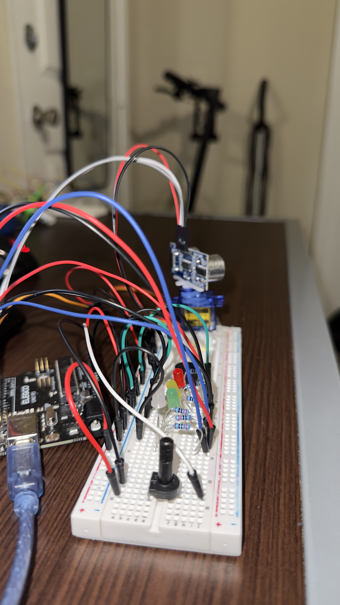

# Forward-Parking-Proximity-Scanner
Arduino-based proximity detection and alert system with a servo controlled by a potentiometer and an ultrasonic sensor mounted on top. Uses RGB LED and standard LEDs along with a passive buzzer to provide audible alerts based on object distance. Demonstrates Embedded C++, sensor integration, servo control, and analog/digital I/O.

## Demo Video

Watch the project in action: [Forward Parking Proximity Scanner Demo](https://youtube.com/shorts/yBNWycz9pFc?feature=share)

## Features
- Potentiometer control of servo motor position
- Ultrasonic sensor mounted on servo 
- Distance detection using ultrasonic sound waves
- Green, yellow, and red LED distance indicators
- RGB LED status indicator
- Passive buzzer with increasing alert frequency as objects get closer
- Real-time distance readings through Serial Monitor

## Hardware Components
-Arduino Uno
-Ultrasonic sensor
-Servo motor
-Potentiometer
-RGB LED
-Green LED
-Yellow LED
-Red LED
-Passive buzzer
-Resistors
-Breadboard
-Jumper wires

## How It Works
1. The potentiometer controls the position of the servo motor, allowing the ultrasonic sensor mounted on top to be positioned at different angles.
2. The ultrasonic sensor sends a short pulse and measures the time required for the echo to return.
3. The Arduino converts the echo duration into an approximate distance measurement.
4. The detected distance determines which LED indicator is activated.
5. As an object gets closer, the passive buzzer changes state at shorter intervals to provide a faster warning.
6. When an object is outside the alert range, the buzzer remains off and the RGB LED indicates a clear status.

## Software Concepts Used
-Embedded C++ programming
-Analog and digital input/output
-map() for converting potentiometer values to servo angles
-Servo motor control
-Ultrasonic distance measurement
-pulseIn() for measuring echo duration
-Conditional statements
-Boolean state variables
-millis() for timing control
-Serial communication and debugging

## Circuit Closeup

This prototype demonstrates the core functionality of the Forward Parking Proximity Scanner. The ultrasonic sensor detects objects at varying distances and provides visual and audible feedback based on proximity. The system has been tested as a standalone circuit and successfully demonstrates the intended sensing, servo positioning, LED indication, and buzzer alert behavior. 
